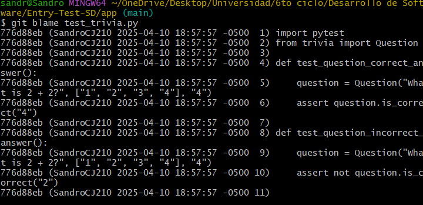
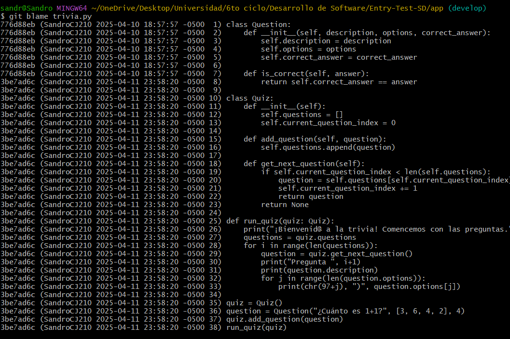
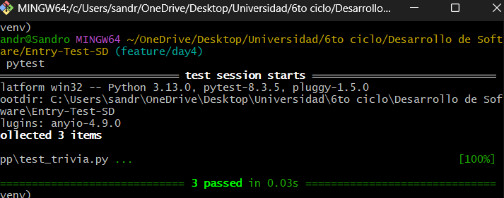
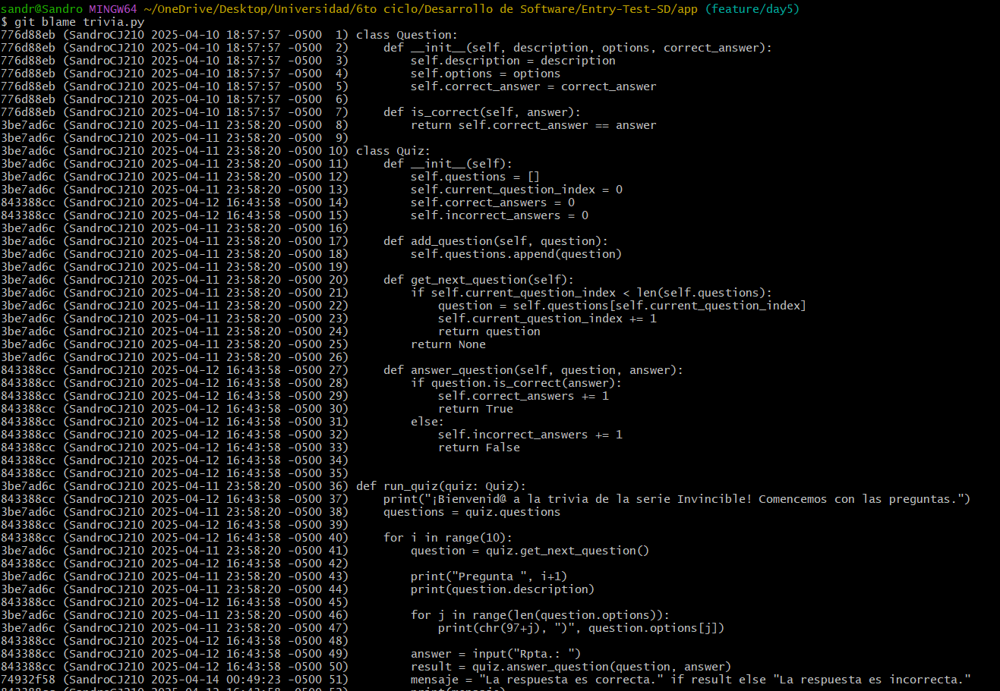
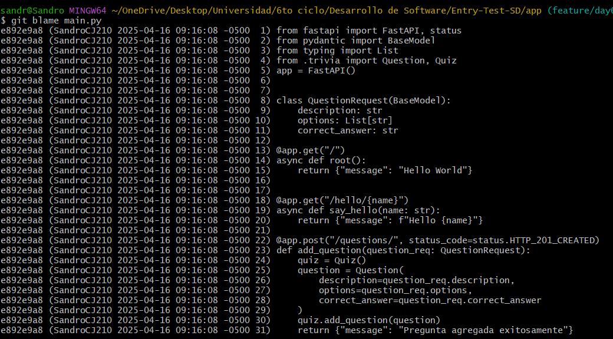
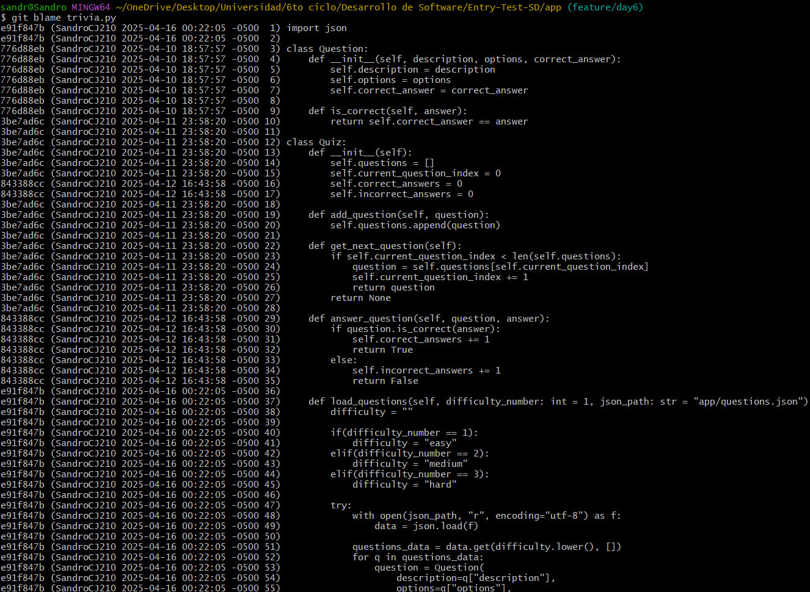
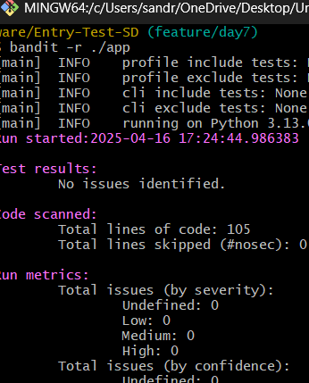
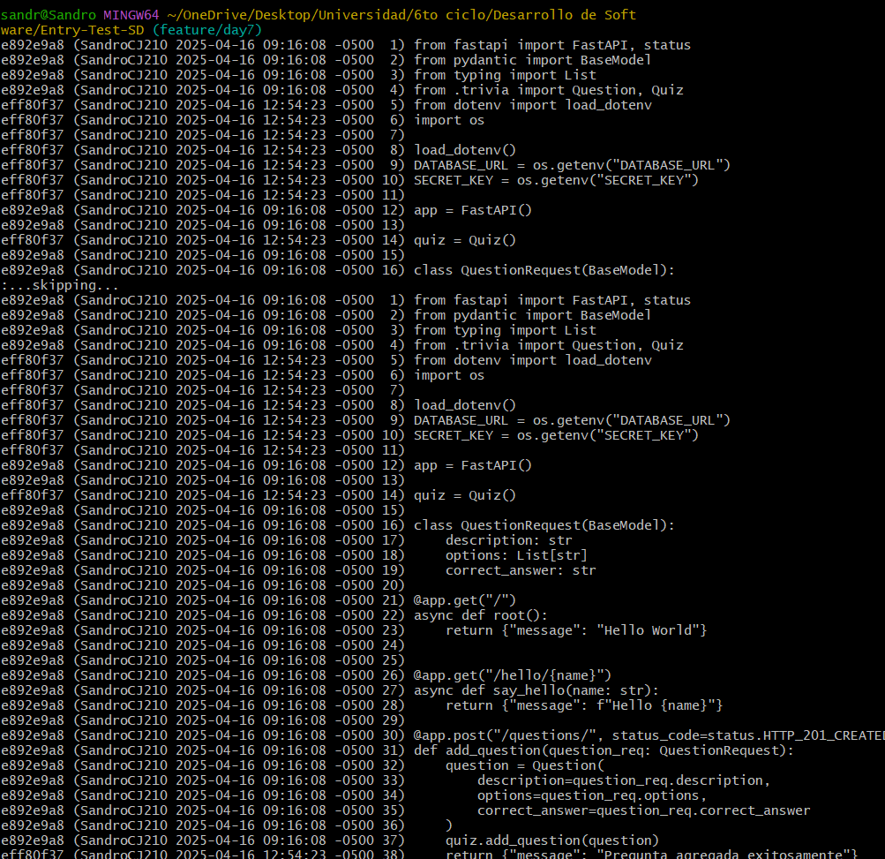

# Desarrollo de Software – Prueba de Entrada
# Registro diario
## Día 2
git blame

## Día 3
Git blame

## Día 4
Test realizado:

## Día 5
git blame

## Día 6
git blame main.py

git blame trivia.py

## Day 7

Uso de bandit

git blame main.py

